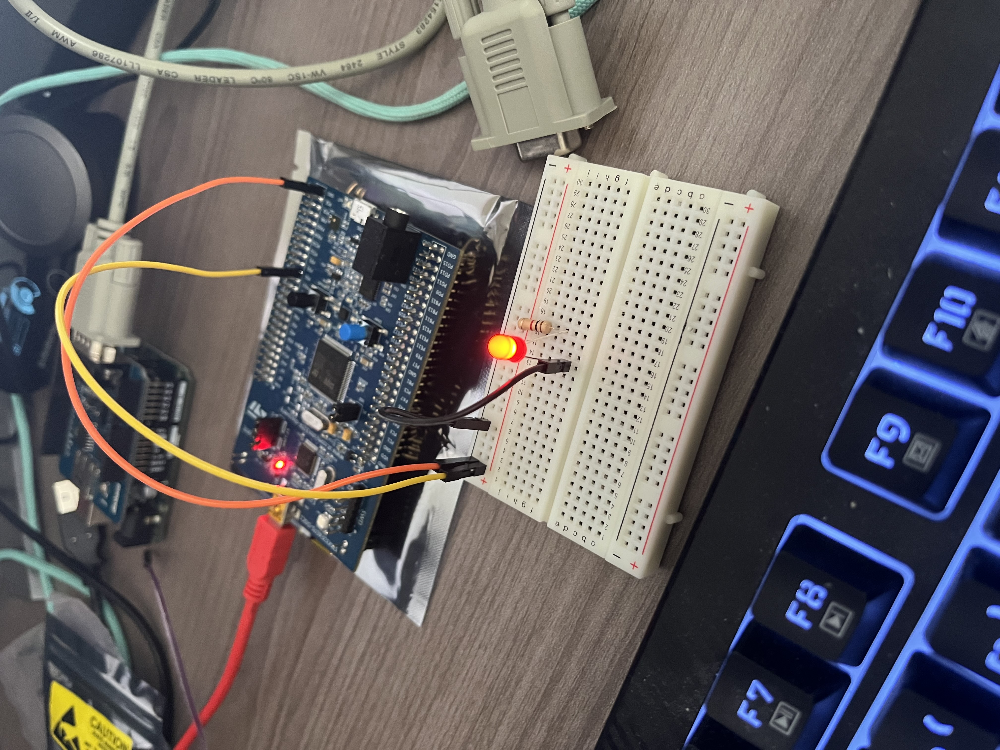

# stm32f407_led_on_project
### This project reads GPIO_A port 0. If a jumper is connected to PA0 and VDD, it turns on the LED. If the jumper cable is connected to PA0 and GND, it turns off the LED. So based on reading the value of port 0 decides if it should turn on LED.

# stm32f407_readinput_led_onoff
